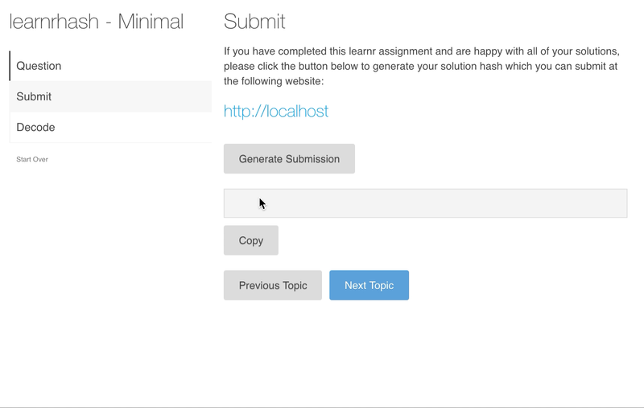

```{r setup, echo=FALSE}
library(tibble)
```

# learnrhash

<!-- badges: start -->
[](https://github.com/rundel/learnrhash/actions)
[](https://www.tidyverse.org/lifecycle/#experimental)
<!-- badges: end -->

## Installation

This package is still in the early stages of development and currently is only available from GitHub. To install the development version run the following:

```r
# install.packages("devtools")
devtools::install_github("rundel/learnrhash")
```

## Usage

This package is meant to provide addition tools for collection student answers to [learnr](https://rstudio.github.io/learnr/) tutorials.
The package does not transmit the answers in any way, but instead provides a convenient method to generate a compressed text based representation that can be easily copied and pasted. The students can then submit these solutions by pasting this "hash" into an online web form (e.g. Google Forms, Microsoft Forms, etc.) or a learning management system quiz or assignment tool.

To enable this functionality, all you need to do is include the following in a learnr Rmd document:
````
## Submit

`r ''````{r context="server"}
learnrhash::encoder_logic()
```

`r ''````{r encode, echo=FALSE}
learnrhash::encoder_ui()
```
````
which results in the Submit topic appearing in the tutorial with all of the necessary shiny logic and ui inserted, as shown below.



In the example above a url for http://localhost given, this value can be replaced with whatever link you would like to use for submission.
All the students will need to do is to paste the generated hash into a text response field on whatever web form you choose to use.

## Working with Hashes

The expectation is that after students submit their solutions you will be able to obtain some tabular representation of these results that can be read into R as a data frame.
The package includes a simple example of this type of data which is loaded as follows

```{r}
example = readRDS(system.file("example.rds", package="learnrhash"))
example
```

Currently the package provides two functions for extracting question solutions and exercise solutions from these hashed data, for both functions the only required argument is the name of the column containing the hashed solutions

To extract the all submissions use,
```{r}
learnrhash::extract_hash(example)
```

and to get just the exercises,
```{r}
learnrhash::extract_exercises(example)
```
or questions,
```{r}
learnrhash::extract_questions(example)
```

If you would like to experiment with this decoding and extraction while writing your tutorial you can also include decoding logic and ui elements into the tutorial in a similar way that the encoder was included. 
Simply add the following lines into your Rmd,
````
## Decode

`r ''````{r context="server"}
learnrhash::decoder_logic()
```

`r ''````{r decode, echo=FALSE}
learnrhash::decoder_ui()
```
````


