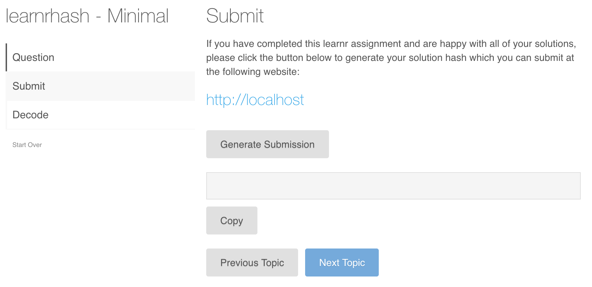

# learnrhash

<!-- badges: start -->
[](https://github.com/rundel/learnrhash/actions)
[](https://www.tidyverse.org/lifecycle/#experimental)
<!-- badges: end -->

## Installation

This package is still in the early stages of development and currently is only available from GitHub. To install the development version run the following:

``` r
# install.packages("devtools")
devtools::install_github("rundel/learnrhash")
```

## Usage

This package is meant to provide addition tools for collection student answers to [learnr](https://rstudio.github.io/learnr/) tutorials.
The package does not transmit the answers in any way, but instead provides a convenient method to generate a compressed text based representation that can be easily copied and pasted. The students can then submit these solutions by pasting this "hash" into an online web form (e.g. Google Forms, Microsoft Forms, etc.) or a learning management system quiz or assignment tool.

To enable this functionality, all that is needed is to include the following in a learnr Rmd:
`````
## Submit

```{r context="server"}
learnrhash::encoder_logic()
```

```{r encode, echo=FALSE}
learnrhash::encoder_ui()
```
``````
which results in the Submit topic appearing in the tutorial with all of the necessary shiny logic and ui inserted, as shown below.



